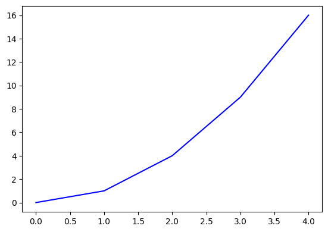

```{r setup, include=FALSE}
knitr::opts_chunk$set(echo = TRUE)
```

## Rmd 파일에 링크 입력하는 방법

문법 : `[링크제목](링크주소)`

R markdown 문법
*장점 : 단조롭고 반복 되는 문법을 간소화
*단점 : 복잡한 문법은 R markdown 으로 표현하기 어려울 수 있음 $\rightarrow$ 다른 사용방법 찾기

* 설정부분에 urlcolor 파란색으로 설정
링크의 색을 (urlcolor : blue in yaml) 설정하지 않으면 구별하기 어려움

## 예제

다음의 링크로 저의 [블로그](https://theisaclee.com)를 연결하도록


## Rmd 파일에 그림 넣는 방법

그림을 넣는 법에는 크게 2가지 방식이 있다.

1. 마크다운 문법을 사용하여 입력
2. R코드를 이용하여 입력 (파이썬도 가능)
3. Latex로 집적입력

우리가 살펴볼 것은 1과 2. 지금은 최대한 3을 지향

### 그림 하나 넣기

```markdown
{ 크기 설정 }
```

* 그림 파일을 rmd파일이 있는 폴더에 같이 저장
* pdf 결과물은 인터넷상에 올려져있는 사진 주소를 바로 넣지는 못함
* html 결과물은 가능

이미지 다운로드 후 working directory에 저장

{width=50%}

이미지 링크 걸기

{width=50%}

### 그림 2개 넣기

그림 2개가 들어가지만 그림에 대한 캡션이 자동으로 달리지 않음
pdf에서는 이를 보완할 방법이 있음

아래의 3줄을 이용

`\begin{figure}[!h]`
`\caption{그림파일 설명}`
`\end{figure}`

begin figure로 시작했기 때문에 중간에 캡션을 그림으로 인식하고 카운트
[!h] !here의 뜻으로 그림을 여기에 넣으라는 의미

```markdown
{width=50%}\ {width=50%}
```

{width=50%}\ 

[](figure2.png){width=50%}

\begin{figure}[!ht]
\caption{Logo Example}
\end{figure}

## R code를 사용해서 넣기 (추천)

html로 바로 변환 가능
여러 그림을 넣을때 기능이 많고 깔끔함.

### 그림 한개 넣기

```{r eval=FALSE}
# knitr::include_graphics("파일 path")
```


```{r figure1, echo=FALSE, fig.cap="그림 설명 부분", fig.align="center", out.width="50%"}
#echo=FALSE 그림넣는 코드는 안보여주기
knitr::include_graphics("figure1.png")
```

### 그림 여러 개 넣기

`- \usepackage{subfig}` : R chunk로 그림 여러개 넣기 위해 필요

```{r multiple, echo=FALSE, fig.cap="전체 그림설명", fig.subcap=c('첫번째 그림', '두번째 그림', '세번째 그림'), out.width="50%",fig.ncol=2,fig.align='center'}
#echo=FALSE 그림넣는 코드는 안보여주기
knitr::include_graphics("figure1.png")
knitr::include_graphics("figure2.png")
plot(cars, pch=19)
```

### 파이썬으로 그림 1개 넣기

파이썬 코드를 rmd에서 돌리게 하기 위해선 R의 reticulate 패키지가 필요함

```{r python_loading packages, echo=FALSE}
library(reticulate)
```


```{python figure2, echo=FALSE, fig.cap="그림 설명 부분", fig.align="center", out.width="50%"}
#echo=FALSE 그림넣는 코드는 안보여주기
import numpy as np
import matplotlib.pyplot as plt

a=np.arange(5)
b= a**2
plt.scatter(a,b)
plt.show()
```


### 파이썬으로 그림 여러개 넣기

파이썬으로 그림 여러개 집어넣는건 rmd에서 지원하지 않음 (sub figure 파이썬은 안됨)

```{python, echo=FALSE}
import numpy as np
import matplotlib.pyplot as plt

fig, ax = plt.subplots(nrows=1, ncols=1)
ax.plot(a,b,color='blue', alpha=1)
fig.savefig('figure3.png', bbox_inches='tight')

```

![grab it!][figure3.png]

```{r multiple2, eval=FALSE, fig.align='center', fig.cap="전체 그림설명", fig.ncol=2, fig.subcap=c('첫번째 그림', '두번째 그림'), out.width="50%"}

plot(iris3,pch=19)

```

